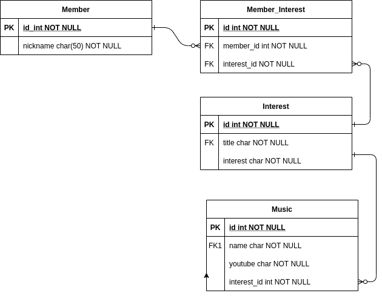

# Getting Started

## 개발환경 설정
### 사전 설치
#### java 설치
- 1.8-amzn
#### mysql
- docker 로 mysql 이미지를 가져와서 실행시킨 후에, docker 로 들어간다.
    ```
    docker pull mysql:8.0.27
    docker run --name music-mysql -p 3306:3306 -e MYSQL_ROOT_PASSWORD=dkagh -d mysql:8.0.27
    docker exec -it music-mysql bash
    ```
- mysql 에서 다음을 설정한다.
  1. 유저 및 권한을 다음과 같이 추가한다.
    ```
    mysql -u root -p
    create user 'seohyun'@'%' identified by 'dkagh';
    grant all privileges on *.* to 'seohyun'@'%';
    flush privileges;
    quit
    ```
  2. mysql 에서 데이터베이스를 생성한다.
    ```
    mysql -u seohyun -p
    show databases;
    create database music_friend;
    ```

## ERD


